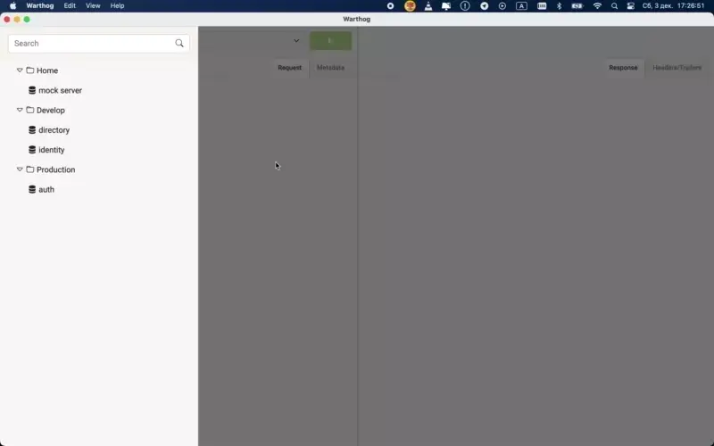

<p align="center">

<h1 align="center">Warthog</h1>
<h4 align="center">Cross platform gRPC GUI client</h4>
</p>
<p align="center">
<a href="https://github.com/forest33/warthog/releases"></a>
<a href="https://goreportcard.com/report/github.com/forest33/warthog" target=”_blank”></a>

<a href="https://github.com/grpc-ecosystem/awesome-grpc"></a>
<br/><br/>

</p>


## Features

- Automatic parsing of proto definitions to render services and input messages
- `.proto` file discovery
- Selection of multiple services and methods
- Configuration of TLS, including disabling TLS (plain text)
- Authentication: Basic, Bearer Token, JWT, GCE
- Kubernetes port forwarding
- Authorization in Google Cloud services
- Input generation for all scalar types
- Input generation for nested and looped messages 
- Input generation for enums, including nested
- Input generation for repeated fields
- Input generation for oneof and map fields
- Support for adding RPC metadata
- Execute unary requests
- Execute server streaming requests
- Execute client streaming requests
- Execute bidirectional requests
- Cancel requests in-flight
- View response messages
- View RPC Header and Trailer
- MacOS build
- Linux build
- Windows build
- Reflection API to determine RPC schema
- Support for Google Well Known Types
- Create multiple workspaces and workspace switching

## Download

Visit the [Releases](https://github.com/Forest33/warthog/releases) page for the latest downloads.

## Install

### Linux

[Download](https://github.com/Forest33/warthog/releases) and unarchive `Warthog*-linux-x86-64.tar.gz` and run.

### MacOS

[Download](https://github.com/Forest33/warthog/releases) and open `Warthog*-darwin-x86-64.dmg` or `Warthog*-darwin-arm64.dmg`, drag `Warthog` to
the `Applications` folder and run from `Applications`.

### Windows

[Download](https://github.com/Forest33/warthog/releases) and run `Warthog*-windows-x86-64.exe`.

## Google Cloud services authorization
- Enable Kubernetes Engine API and check quota for your project at [https://console.developers.google.com/apis/api/container](https://console.developers.google.com/apis/api/container)
- Install gcloud CLI from [https://cloud.google.com/sdk/](https://cloud.google.com/sdk/) and run:
````
  gcloud beta auth application-default login
````